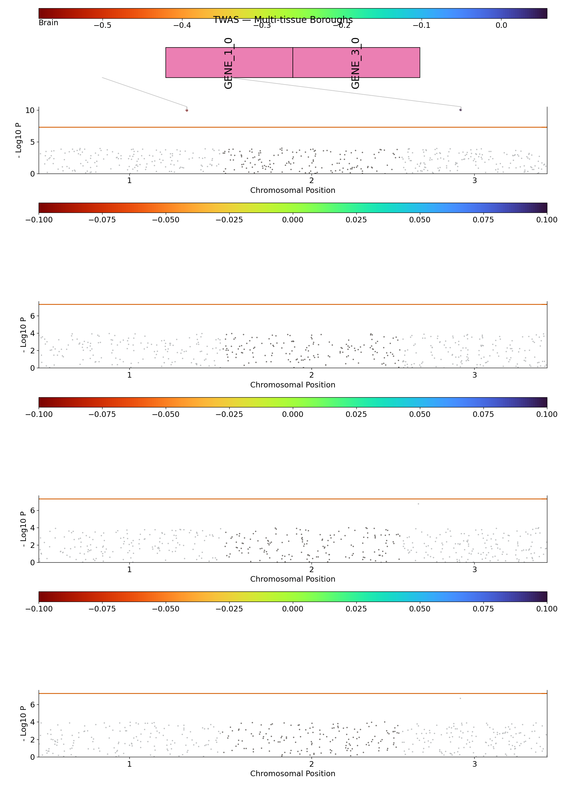

# TWAS / Boroughs Plot

The `BoroughsPlot` class creates **faceted Manhattan plots** — one panel ("borough") per category in a `WRAP` column. The primary use case is **TWAS** results where you want one panel per tissue or cell type, but any categorical grouping works.

## Required column: WRAP

Your input file must contain a `WRAP` column that defines which facet each row belongs to:

```
#CHROM  POS       ID        P         WRAP
1       1234567   GENE_A    3.2e-9    Brain_Cortex
1       1234567   GENE_A    1.8e-7    Liver
2       5678901   GENE_B    4.1e-6    Brain_Cortex
...
```

---

## Basic usage

```python
from neat_plots import BoroughsPlot

bp = BoroughsPlot("twas_results.tsv.gz", title="TWAS — Multi-tissue")
bp.prepare(
    col_map={"CHR": "#CHROM", "BP": "POS", "GENE": "ID", "P_VALUE": "P"}
)
bp.update_plotting_parameters(
    sig=5e-8,
    signal_color_col="TISSUE_TYPE",   # color peaks by a column
    merge_genes=True,
)
bp.full_plot(save="boroughs.png", legend_loc="top")
```



---

## Legend placement

The `legend_loc` parameter controls where the color-bar / legend appears:

| Value | Effect |
|-------|--------|
| `"top"` | Categorical legend above each borough panel |
| `None` (default) | Continuous color bar |

---

## Directional markers (TWAS up/down)

For TWAS results where you want to distinguish up- vs. down-regulated genes, set `twas_updown_col` to the column containing the effect-direction value (negative = down, positive = up):

```python
bp.update_plotting_parameters(
    twas_color_col="TISSUE_TYPE",
    twas_updown_col="BETA",       # column with effect size / direction
)
bp.full_plot(save="boroughs_updown.png", legend_loc="top")
```

Upward triangles (▲) mark positive-effect signals; downward (▽) mark negative-effect signals, colored by tissue.

---

## Chunked loading for large TWAS files

```python
bp.prepare(chunked=True, chunksize=500_000)
```

Because `BoroughsPlot` adds `WRAP` to the thinning uniqueness key, the same genomic position can appear in multiple boroughs after thinning — which is the intended behavior.

---

## Iterating over annotation/MAF combinations

A common ExWAS pattern is to loop over annotation and MAF groups, generating one boroughs figure per combination:

```python
annotation_groups = ["LoF", "Missense", "Synonymous"]
maf_bins          = ["rare", "common"]

for annot in annotation_groups:
    for maf_bin in maf_bins:
        subset = full_df[
            (full_df["ANNOTATION"] == annot) & (full_df["MAF_BIN"] == maf_bin)
        ]
        subset.to_csv(f"/tmp/{annot}_{maf_bin}.tsv", sep="\t", index=False)

        bp = BoroughsPlot(
            f"/tmp/{annot}_{maf_bin}.tsv",
            title=f"{annot} — {maf_bin} MAF",
        )
        bp.prepare()
        bp.full_plot(
            save=f"boroughs_{annot}_{maf_bin}.png",
            legend_loc="top",
        )
```

---

## Controlling which signals appear

```python
bp.update_plotting_parameters(
    sig=5e-8,          # genome-wide significance
    sug=1e-5,          # suggestive threshold
    annot_thresh=5e-8, # only annotate hits at this level or better
    ld_block=4e5,      # merge signals within 400 kb (default)
    merge_genes=True,  # collapse overlapping LD windows
)
```
