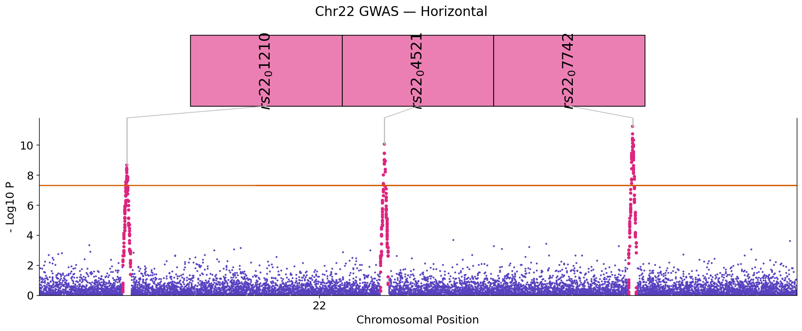
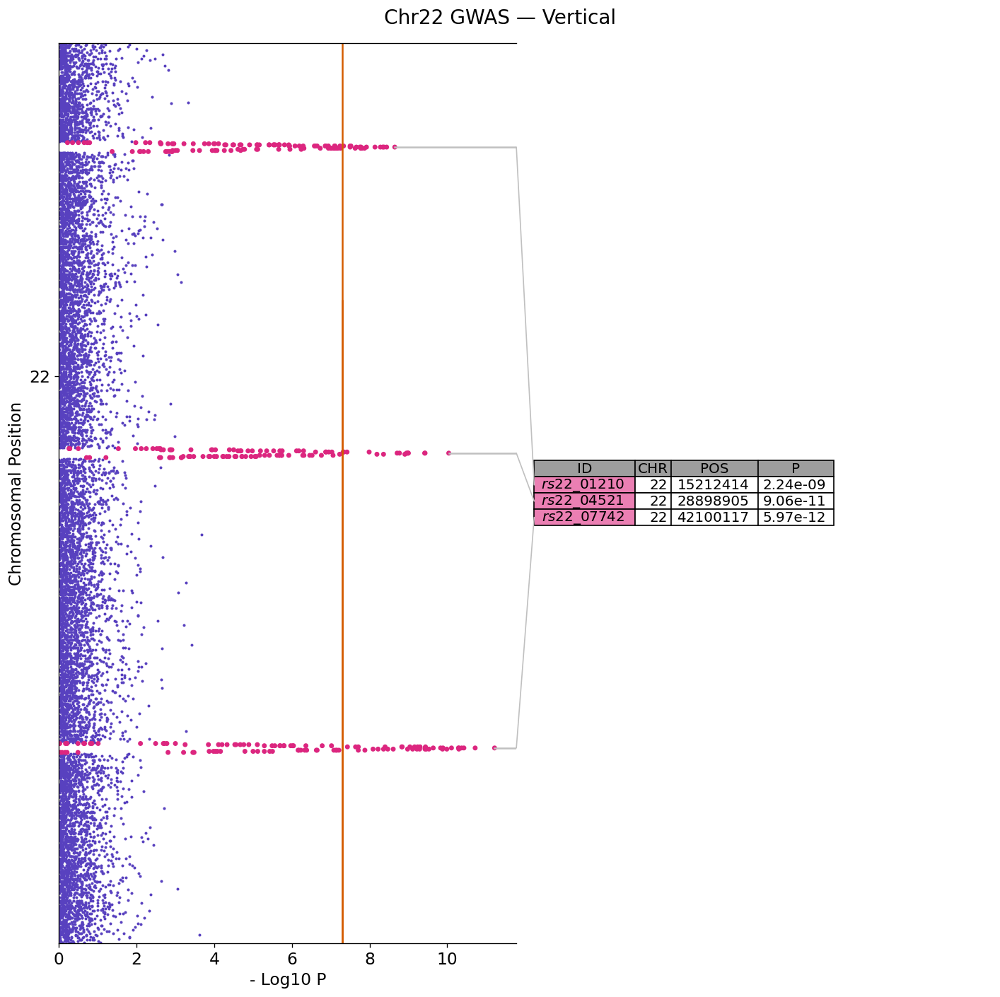
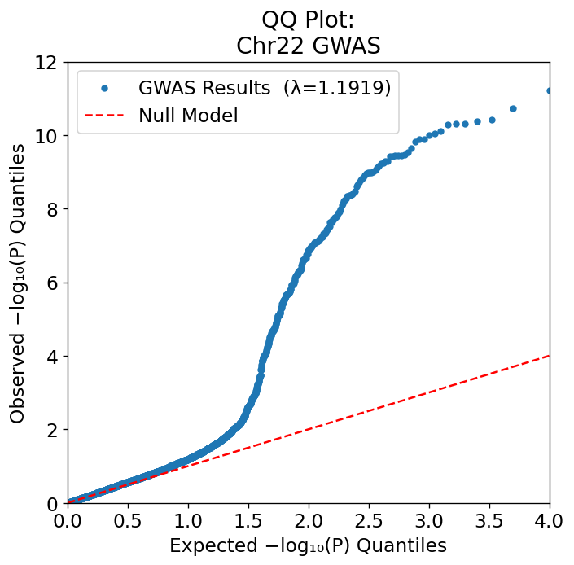
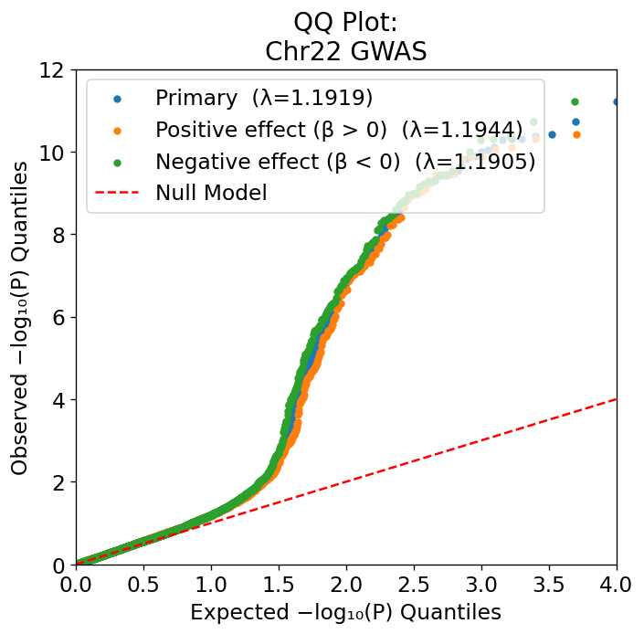

# GWAS Manhattan & QQ Plots

## Basic horizontal Manhattan

```python
from neat_plots import ManhattanPlot

mp = ManhattanPlot("gwas.tsv.gz", title="BMI GWAS — European Ancestry")
mp.prepare(col_map={"CHR": "#CHROM", "BP": "POS", "SNP": "ID", "P": "P"})
mp.update_plotting_parameters(
    sig=5e-8,
    sug=1e-5,
    merge_genes=True,
    vertical=False,
)
mp.full_plot(save="manhattan_horizontal.png")
```



---

## Vertical orientation

Swap to a vertical layout by setting `vertical=True`:

```python
mp.update_plotting_parameters(vertical=True)
mp.full_plot(save="manhattan_vertical.png")
```



---

## Without the annotation table

```python
mp.full_plot(save="manhattan_notab.png", with_table=False)
```

Useful for slide figures or when you want a cleaner single-panel output.

---

## Significance thresholds

```python
mp.update_plotting_parameters(
    sig=5e-8,          # genome-wide significance line (default)
    sug=1e-5,          # suggestive line
    annot_thresh=5e-8, # which variants get annotated in the table
)
```

For ExWAS, compute a Bonferroni threshold dynamically:

```python
mp.prepare(...)
n_tests   = len(mp.df)
threshold = 0.05 / n_tests
mp.update_plotting_parameters(sig=threshold, sug=threshold * 10)
```

---

## Capping the y-axis

For very significant hits (P < 10⁻³⁰) that visually dominate the plot, cap the axis:

```python
mp.update_plotting_parameters(max_log_p=30)
mp.full_plot(save="manhattan_capped.png")
```

---

## Adding gene annotations

Supply a DataFrame with `#CHROM`, `POS`, and `ID` columns:

```python
import pandas as pd

gene_df = pd.read_table("gene_annotations.tsv")
mp.prepare(annot_df=gene_df)
```

Or add them after loading:

```python
mp.load_data()
mp.clean_data()
mp.add_annotations(gene_df)
mp.get_thinned_data()
```

---

## Highlighting replicated loci

Pass a list of gene names to color them gold and boost their priority in the table:

```python
rep_genes = ["FTO", "MC4R", "TMEM18"]
mp.full_plot(rep_genes=rep_genes, save="manhattan_rep.png")
```

---

## Coloring by a continuous column

Use the `signal_color_col` parameter to color signal peaks by any numeric column (e.g., effect size):

```python
mp.update_plotting_parameters(signal_color_col="BETA")
mp.full_plot(save="manhattan_colored.png")
```

---

## QQ plot

```python
mp.qq_plot(save="qq.png")
```



The lambda GC (genomic inflation factor) is printed to stdout and annotated on the figure.

### Multi-series QQ

Overlay subgroup P-value distributions on the same axes:

```python
males_p   = sumstats_males["P"]
females_p = sumstats_females["P"]

mp.qq_plot(
    save="qq_multi.png",
    additional_series={
        "Males":   males_p,
        "Females": females_p,
    },
)
```



Each series gets its own colour and λ GC value in the legend.

!!! tip "Using saved QQ CSVs"
    Every `qq_plot(save=...)` call writes a `.csv` alongside the PNG with the
    plotted log-quantile pairs.  You can collect these CSVs from multiple runs
    and pass the resulting series as `additional_series` without re-loading the
    full summary statistics.

---

## Saving and resolution

```python
mp.full_plot(save="manhattan.png", save_res=300)   # 300 DPI for print
mp.full_plot(save="manhattan.pdf")                  # vector PDF
```

---

## Saving the thinned DataFrame

```python
mp.save_thinned_df("thinned.pickle")          # pickle (default)
mp.save_thinned_df("thinned.csv", pickle=False)  # CSV
```

The thinned pickle can be reloaded as a `ManhattanPlot` input — useful for iterating on plot styling without re-loading large files.
